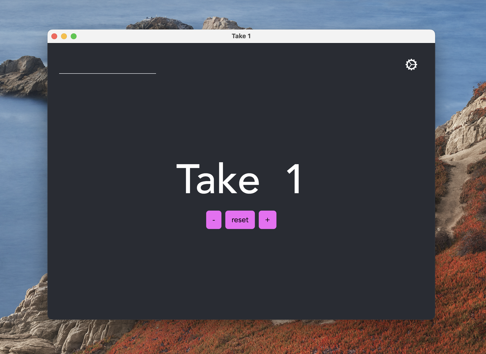

# Take Counter 

Take Counter is an app to help track takes during recording sessions. It allows
engineers to keep the current take visible on screen while working in another
app like ProTools. Global keyboard shortcuts allow the engineer to change the
current take without distraction. 

Take Counter is available as a Universal MacOS app. 
[A web version is also available.](https://takecounter.kyleclapper.dev)

## Features

- Increment, decrement, and reset the current take
- Type in a new take number
- Customizable global keyboard shortcuts
- Always on top display (togglable)

## Organization 
This app has two major components; a web app and an Electron app.
The web app is built such that when it's operating in an Electron 
environment, it has enhanced capabilities. Otherwise it behaves 
exactly the same whether on the native app or the web. The web app
and Electron app are in their respective folders.
